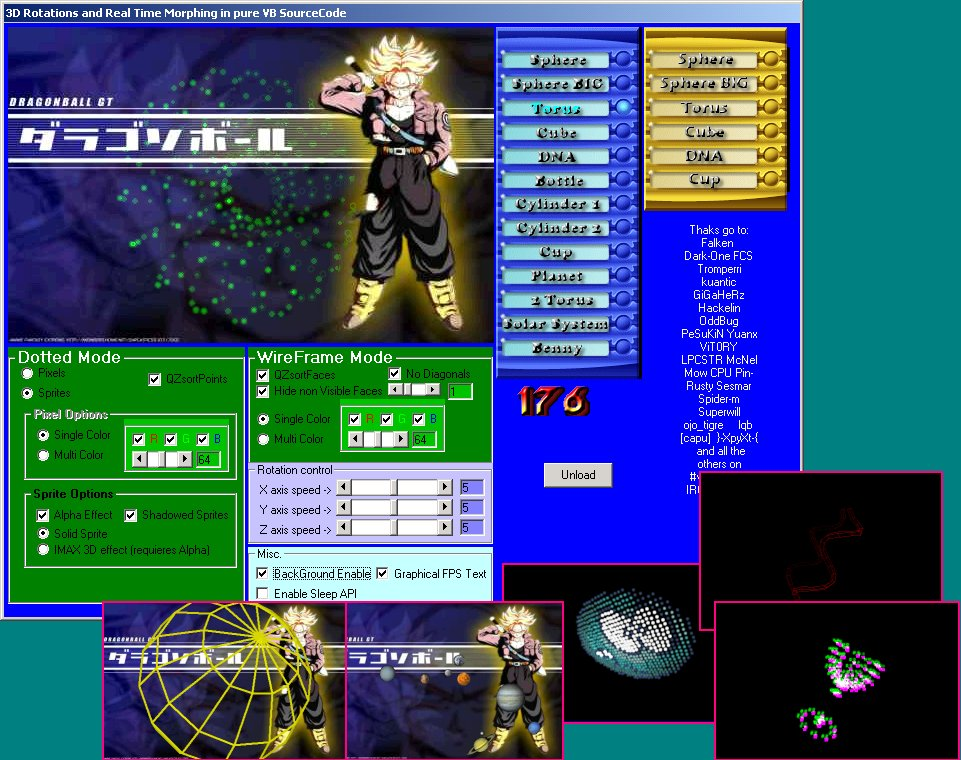



## A realtime 3DvbROT and MORPH

### Description

3DvbROT its done in PURE VB, no DirectX, no OpenGL, no External OCXs or DLLs. Just a few API like BitBlt

This code show to you a rotate a complex 3D Mesh (no more cubes! plesase! xD)

The rotation between 2 meshes its done by morphing

There are 2 modes: Dotted mode or WireFrame Mode

On Dotted Mode you can draw mesh with pixels or with sprites. You can ajust the color of them and

apply some cool effects (like IMAX 3D xDDDD)

On WireFrame Mode you can disable ocult faces and diagonals for increase the speed.

On my PC (a "old" K6-2 i've got up 419 frames per second in some meshes, and i tested this code

on very very fast machine (P4 or Atlhon) and i've got more than 2000 Frames per second).

Consult TOOLTIPs for a little description that flags can do.

The structure of the code are well comented, and the name of variables and Subs explaind it selfs.

Only a elementary maths and trigonometry are necesary.

The original Meshes were created in a old release of 3Dstudio (3DStudio version 2.0) and converted

in a dVB file with a little vb program that i make. If you want to experiment with your own meshes,

please e-mail me and i will send this little program.

Spanish:

Este codigo te permitira rotar una figura geometrica "compleja" (se acabo aquello de solo rotar cubos)

Existen 2 metodos: Dotted mode (pixels o sprites) y WireFrame Mode (representación por lineas)

En el metodo Dotted Mode podras variar el color de los pixels o sprites, pudiendo tener efectos de

luz (los puntos mas cercanos se veran mas "claros" y los mas lejanos mas "ocuros")

Ademas, podras "emular" un efecto 3D simpre que tengas unas gafas para tal efecto (como esas peliculas

que necesitan de unas gafas verdes y rojas para verlas! xDD)

En mi K6 he obtenido mas de 419 frames por segundo, pero he probado este codigo en cacharros rapidos

(P4 o Atlhon) y se ha alcanzado una tasa de mas de 2000 Frames por segundo.

Consulta los TOOLTIps de los flags para saber lo que hacen (estan en ingles, que se le va a hacer!)

Las figuras han sido creadas con una version bastante antigua de 3DStudio (la version 2.0) grabando la

Mesh como un fichero ASC. Para poderlas usar en este programa, me hize una pequeña rutina en VB (apenas

30 lineas de codigo) para poder usarlas. Si quieres este programa enviame un e-mail y te la hare llegar

lo antes posible.
 
### More Info
 

             |
---                |---
**Submitted On**   |2003-02-17 00:45:10
**By**             |[John Ripper](https://github.com/Planet-Source-Code/PSCIndex/blob/master/ByAuthor/john-ripper.md)
**Level**          |Intermediate
**User Rating**    |5.0 (223 globes from 45 users)
**Compatibility**  |VB 4\.0 \(32\-bit\), VB 5\.0, VB 6\.0
**Category**       |[Graphics](https://github.com/Planet-Source-Code/PSCIndex/blob/master/ByCategory/graphics__1-46.md)
**World**          |[Visual Basic](https://github.com/Planet-Source-Code/PSCIndex/blob/master/ByWorld/visual-basic.md)
**Archive File**   |[A\_realtime1545792172003\.zip](https://github.com/Planet-Source-Code/john-ripper-a-realtime-3dvbrot-and-morph__1-43292/archive/master.zip)

